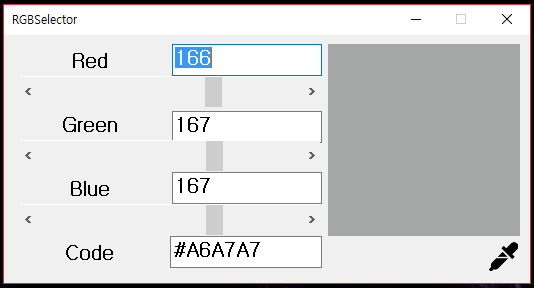

# RGB Selector

간단하게 RGB값을 확인할수 있는 어플리케이션

### 개발 언어 : C#
### 닷넷프레임워크 버전 : 4.7.1

주요 소스코드는 **[Form1.cs](Form1.cs)** 파일을 참조하세요

Applications that can easily check RGB values

### Language : C#
### .NetFramework Version : 4.7.1

Please refer to **[Form1.cs](Form1.cs)** for the main source code
